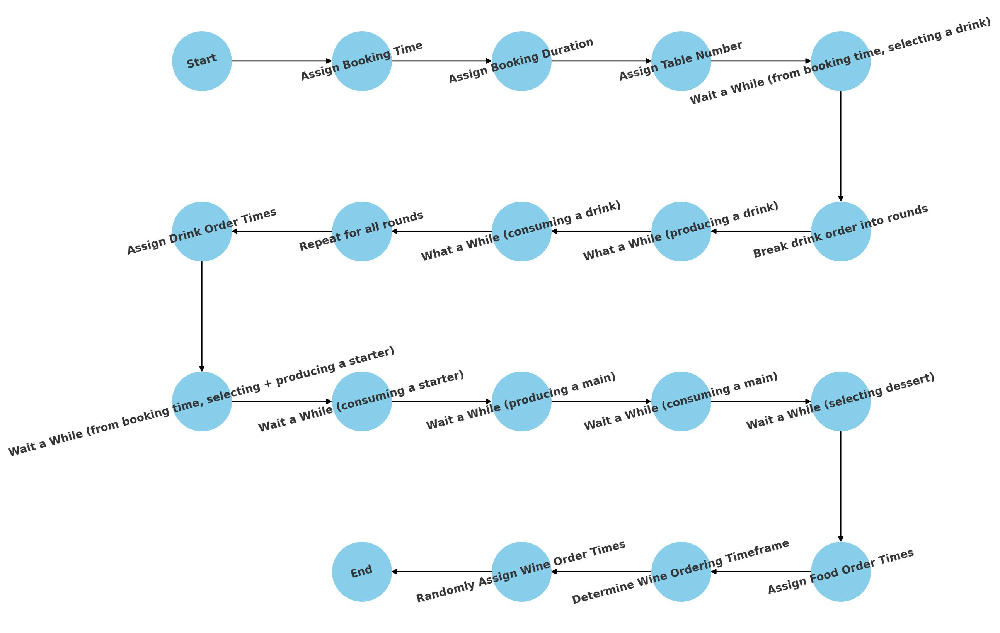

# `allocate_ordering_times.py`

`Desc:` allocates timestamps to a group_order's 🧑‍🤝‍🧑 items' uuids

This script 📝 completes the ordering process simulation by allocating realistic timestamps for booking, drinks 🍷, food 🍽️, and wine orders. The script uses configuration values ⚙️ to drive its behaviour.

## Overview

1. **Allocates _BOOKING TIMES_**: Using [configuration values](sim_config.json) and available tables (based on guest count) assigns each group a booking time, a booking duration, and a table number by finding free slots at 15-minute intervals between the opening and last booking time.
2. **Assigns _DRINK ORDER TIMES_**: partitions each group’s drink orders (both alcoholic and non-alcoholic) into rounds and assigns a random timestamp for the first round (after a configurable wait) and calculates subsequent rounds by adding fixed production time and random consumption delays.
3. **Assigns _FOOD ORDER TIMES_**: timestamps food orders by first choosing a candidate food start time (randomly between a configurable minimum and maximum after booking, and not before drinks are ordered). Starters (if any) are ordered at that time, mains (and sides) are then ordered either immediately (if no starters) or after the starters finish plus any additional cooking time, and finally desserts are ordered at a random offset after the mains have been consumed.
4. **Assigns _WINE ORDER TIMES_**: schedules both regular and dessert wine orders by randomly choosing timestamps within appropriate bounds (from the earliest drink order to the dessert order time or close time for regular wines, and after desserts for dessert wines), adjusting times if they fall within a small window of another order's timestamp.

  

## Global Variables

| Variable        | Definition                                                           |
|-----------------|----------------------------------------------------------------------|
| `config_file`   | `"sim_config.json"` - The file containing configurations for the simulation, such as table numbers, times and time periods. |

## Functions

| Function Name                                      | Description                                                                                           |
|----------------------------------------------------|-------------------------------------------------------------------------------------------------------|
| [`allocate_booking_times()`](#allocate_booking_times)              | Allocates booking start times for each group based on the number of guests and available table numbers. |
| [`allocate_drink_order_times()`](#allocate_drink_order_times)                    | Assigns ordering timestamps for both alcoholic and non-alcoholic drink orders. |
| [`allocate_food_order_times()`](#allocate_food_order_times)                        | Allocates ordering timestamps for food items: starters, mains (and sides), and desserts. |
| [`allocate_wine_order_times()`](#allocate_wine_order_times)                     | Allocates ordering timestamps for wine orders (both regular and dessert wines). |
| [`allocate_ordering_times()`](#allocate_ordering_times)                    | Serves as an orchestrator that calls the above functions in sequence to allocate all ordering times for a given night's service. |

 

 

---
### `allocate_booking_times(group_orders)`
  Allocates booking start times for each group based on the number of guests and available table numbers.
- **Rules:**
  - Groups of 1–2 guests are given a 90-minute booking, 3–4 guests a 150-minute booking, and 5+ guests a 180-minute booking.
  - Bookings start every 15 minutes between the configured opening time and last booking time.
  - The ideal start time is used as a reference (e.g. 8:00 PM), and alternative times are tried if conflicts occur.
- **Outcome:**  
  Each group in `group_orders` is updated with a `booking_time`, `booking_duration`, and `table_no`.
 

---
### `allocate_drink_order_times(group_orders)`
  Assigns ordering timestamps for both alcoholic and non-alcoholic drink orders.
- **Rules:**
  - Drink orders start after an initial wait time (between configured minimum and maximum wait times) following the booking.
  - Orders are grouped into rounds (with the number of rounds being the minimum of total drinks or guest count), where each round’s timestamp is determined by a production time (fixed 10 minutes) plus a random consumption delay (15–25 minutes).
  - If the chosen timestamp is within a configured timeframe of any other food/drink order, it is merged to that order’s time.
- **Outcome:**  
  The lists `alc_drinks` and `non_alc_drinks` in each group are updated to be lists of tuples `(item_uuid, order_time)`.
 

---
### `allocate_food_order_times(group_orders)`

  Allocates ordering timestamps for food items: starters, mains (and sides), and desserts.
- **Rules:**
  - A candidate food order start time is chosen randomly (between config["initial_food_order_wait_time_min"] and config["initial_food_order_wait_time_max"] minutes after booking), but not before 1 minute after the earliest drink order.
  - **Starters:**  
    If ordered (non-None), they are placed at the food start time. Their total time (prep + consumption) is randomly chosen between config["starters_consumption_time_min"] and config["starters_consumption_time_max"]. They finish at `starters_finish = food_start + T_starters`.
  - **Mains (and sides):**  
    If starters exist, a target main prep time is randomly chosen between config["mains_prep_time_min"] and config["mains_prep_time_max"]. The mains order time is set to `starters_finish + additional_cooking` (where additional_cooking = max(0, T_main - T_starters)). If no starters exist, mains are ordered immediately at food_start and are ready after the full T_main minutes.
    Then, a consumption time (random between config["mains_consumption_time_min"] and config["mains_consumption__time_max"]) is added.
  - **Desserts:**  
    Instead of a fixed delay, desserts are ordered at a random time between config["desserts_order_time_min"] and config["desserts_order_time_max"] minutes after mains have been consumed.
- **Outcome:**  
  Food categories (`starters`, `mains`, `sides`, `desserts`) are updated so that each non-None item is replaced by a tuple `(item_uuid, order_time)`.
 

---
### `allocate_wine_order_times(group_orders)`

  Allocates ordering timestamps for wine orders (both regular and dessert wines).
- **Rules for Regular Wines:**
  - The order time is chosen randomly between the earliest drink order time (or booking_time if none exist) and the earliest dessert order time (if any) or the group’s close time.
  - If the chosen time is within a configured timeframe (merge_orders_timeframe) of any other food/drink order time (from starters, mains, desserts, alc_drinks, or non_alc_drinks), it is adjusted to match that time.
- **Rules for Dessert Wines:**
  - The lower bound is the earliest dessert order time if desserts are ordered; otherwise, it is approximated as the maximum main order time plus a configured delay.
  - The upper bound is the group’s close time.
  - A random order time is chosen between these bounds and adjusted similarly.
- **Outcome:**  
  The lists `wines` and `dessert_wines` are updated to be lists of tuples `(item_uuid, order_time)`.
 

---
### `allocate_ordering_times(group_orders)`

  Serves as an orchestrator that calls the above functions in sequence to allocate all ordering times for a given night's service.
- **Outcome:**  
  Returns the updated `group_orders` dictionary containing all allocated times (booking, drink, food, wine).

---

