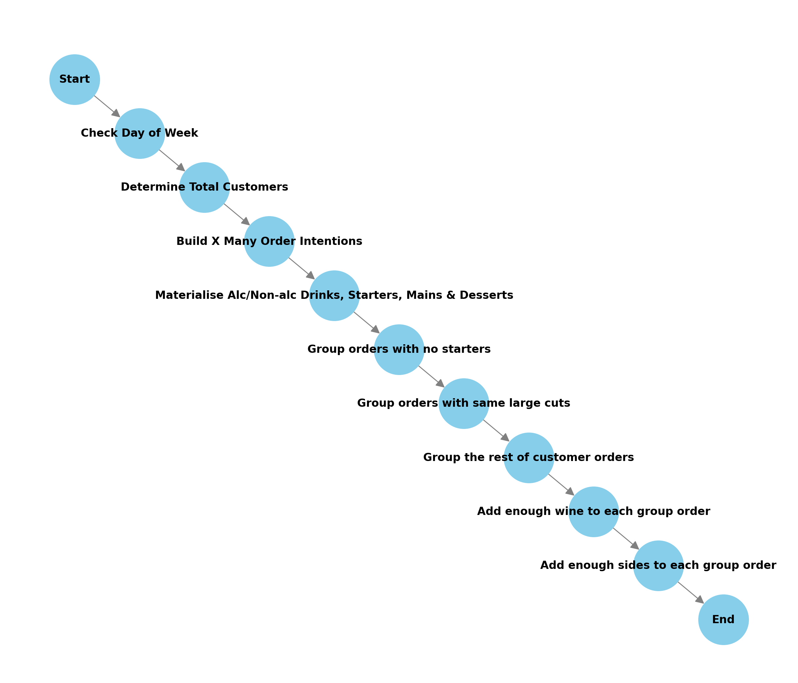

# `generate_group_orders.py`

`Desc:` generates customer order intentions, processes them into actual customer orders, then organises them into groups. 

This script 📝 simulates the process of customers 👨‍💻 selecting food 🍽️ and drink 🍷 based on the predefined probabilities 🎲 in the config file ⚙️.

## Overview

1. **Generates _CUSTOMER ORDER INTENTIONS_**: based on probability distributions loaded from a [configuration file](sim_config.json).
2. **Materialises  _INTENTIONS_ into individual _CUSTOMER ORDERS_**: selects items from a provided menu of items (such as starters, mains, drinks, etc.).
3. **Groups together _CUSTOMER ORDERS_**: organises orders into groups based on certain criteria (e.g., customers without starters are grouped together, customers with the same sharing main item are grouped together).
4. **Adds _WINE_ to satisfy a _GROUP's_ wine order INTENTION**: both regular and dessert wine
5. **Adds _SIDES_ and _EXTRAS_ to _GROUP ORDERS_**: based on choice of main and probability set in the [configuration file](sim_config.json).

<br><br>


## Global Variables

| Variable        | Definition                                                           |
|-----------------|----------------------------------------------------------------------|
| `file_counter`  | `1` - Used to name file logs, incremented each time a new file is saved. |
| `verbose`       | `False` - Set to `True` if you want to see the structures being logged (debugging purposes). |
| `config_file`   | `"sim_config.json"` - The file containing configurations for the simulation, such as probability distributions, menu categories, etc. |


## Functions 

| Function Name                                      | Description                                                                                           |
|----------------------------------------------------|-------------------------------------------------------------------------------------------------------|
| [`generate_customer_order_intention()`](#generate_customer_order_intention)              | Generates a random customer order intention based on the probabilities specified in the configuration file. |
| [`generate_list_of_intentions()`](#generate_list_of_intentions)                    | Generates a list of customer order intentions with varying customer count based on the day of the week. |
| [`generate_customer_order()`](#generate_customer_order)                        | Processes a customer order intention and a menu, returning UUIDs for selected items (alc_drinks, non_alc_drinks, starter_id, main_id, dessert_id). |
| [`group_customer_orders()`](#group_customer_orders)                          | Groups processed customer orders into parties based on certain criteria.                              |
| [`generate_group_wine_orders()`](#generate_group_wine_orders)                     | Generates wine orders for each group of customers based on the total required wine servings.          |
| [`generate_group_side_orders()`](#generate_group_side_orders)                     | Generates side orders for each customer in a group, adding sauces and extras where appropriate.        |
| [`generate_final_group_orders()`](#generate_final_group_orders)                    | Serves as an orchestrator that calls the above functions in sequence to generate the final group orders data structure.           |
| [`select_wine_from_menu()`](#select_wine_from_menu)                    | Select wines from the items menu to satisfy the required amount by a group of orders.           |
| [`log_generation_step()`](#log_generation_step)                    | In verbose mode, prints out a data structure to a `.txt` file in `..\data\raw\sim_logs\`(used for debugging).           |

<br>

<br>

---
### `generate_customer_order_intention()`

Generates a random customer order intention based on the probabilities specified in the `sim_config.json` configuration file.

**Output**: `customer_order_intention_dict: {}`

- A dictionary representing a single customer's order intention, including:
  - Number of alcoholic drinks (`n_alc_drinks`)
  - Number of wine servings (`n_wine_servings`)
  - Number of non-alcoholic drinks (`n_non_alc_drinks`)
  - Whether the customer wants a starter, main, and/or dessert.
- Example:
```json
{
    "n_alc_drinks": 1,
    "n_wine_servings": 1,
    "n_dessert_wine_servings": 1,
    "n_non_alc_drinks": 2,
    "b_starter": true,
    "b_main": true,
    "b_dessert": false
}
```
<br>

---
### `generate_list_of_intentions`

Generates a list of customer order intentions, with the number of customers varying based on the day of the week, with `min` and `max` values specified in the `sim_config.json` configuration file.

**Output**: `all_customer_orderintentions: []`
- A list of dictionaries, each representing a customer's order intention.

<br>

---
### `generate_customer_order(customer_order_intention_dict, full_menu_df)`

Processes a customer's order intention and a given menu of items and returns a dictionary containing UUIDs of selected `alc_drinks`, `non_alc_drinks`, `starter_id`, `main_id`, and `dessert_id`. Wine is processed separately.

**Input**:
- `customer_order_intention_dict`: A dictionary containing the order intention for a customer.
- `full_menu_df`: A dataframe containing the all menu items.

**Output**: `customer_order_dict: {}`

- A dictionary containing the customer's actual order with selected item ids (e.g., starters, mains, drinks, etc.).
- Example:
```json
{
    'alc_drinks': ['8f0db82b'], 
    'n_wine_servings': 0, 
    'n_dessert_wine_servings': 1, 
    'non_alc_drinks': [], 
    'starter_id': '503815c8', 
    'main_id': '2da25f9c', 
    'dessert_id': 'ed295744'
}
```
<br>

---
### `group_customer_orders(all_customer_orders, full_menu_df)`

Groups the processed customer orders into parties based on certain criteria:
1. Customers without starters are grouped into parties of 1 to 4.
2. Customers with the same sharing main item (if its category is "Large Cuts") are grouped into parties of 2 to 6.
3. The remaining customers are grouped into parties of 1 to 4.

**Input**:
- `all_customer_orders`: A list of customer orders.
- `full_menu_df`: A dataframe containing the all menu items.

**Output**: `group_mapping: {}`

- A dictionary mapping a group ID to a list of customer order indices.
- Example:
```json
{
    "1": [
        2,
        7,
        8,
        9
    ],
    "2": [
        11
    ],
    "3": [
        12
    ],
    "4": [
        13,
        14
    ],
    "5": [
        25,
        30,
        35
    ],
    ...
}
```
<br>

---
### `generate_group_wine_orders(customer_groups, all_customer_orders, full_menu_df)`

Generates wine orders for each group of customers based on the total wine servings required for the group.

**Input**:
- `customer_groups`: A dictionary containing the groups of customers.
- `all_customer_orders`: A list of customer orders.
- `full_menu_df`: A dataframe containing the full menu items.

**Output**: `group_wine_orders: {}`

- A dictionary mapping group IDs to their wine orders and dessert wine orders item ids.
- Example:
```json
{
    "1": {
        "wine_orders": [
            "b097faaa",
            "9ab69df4"
        ],
        "dessert_wine_orders": [
            "7d482dd7",
            "bbcc7ebd"
        ]
    },
    "2": {
        "wine_orders": [
            "8b96642b"
        ],
        "dessert_wine_orders": [
            "1b647f94"
        ]
    },
    "3": {
        "wine_orders": [
            "ac09a974"
        ],
        "dessert_wine_orders": [
            "b7319e87"
        ]
    },
    ...
}
```
<br>

---
### `generate_group_side_orders(customer_groups, processed_orders, full_menu_df)`

Generates side orders for each customer in a group, adding sauces and extras where appropriate.

**Input**:
- `customer_groups`: A dictionary containing the groups of customers.
- `processed_orders`: A list of processed customer orders.
- `full_menu_df`: A dataframe containing the full menu items.

**Output**: `group_side_orders: {}`

- A dictionary mapping each group ID to a dictionary of side, sauce, and extras for each customer.
- Example:
```json
{
    "1": {
        "4": {
            "side": "2b63a5a0",
            "sauce": null,
            "extras": null
        },
        "8": {
            "side": "2b63a5a0",
            "sauce": "cbf7e422",
            "extras": null
        },
        "9": {
            "side": "c6a18735",
            "sauce": null,
            "extras": null
        }
    },
    ...
}
```
<br>

---
### `generate_final_group_orders(full_menu_df)`

This is the main function which calls all other functions in sequence to generate the `final_ group_orders` dictionary. 

1. It generates a list of intentions.
2. It fetches id's from the menu provided for every oreder intention to create a list of orders
3. It groups the inital orders
4. It adds wine to the group orders
5. It adds sides to the group orders
6. Combines everything into one final dictionary

**Input**:
- `full_menu_df`: A dataframe containing the full menu items.

**Output**: `final_group_orders: {}`
- A nested dictionary containing the final group orders.
- Example:
```json
{
    "group_1": {
        "starters": [
            null,
            null,
            null
        ],
        "mains": [
            "a6f6b4cd",
            "545641a1",
            "bd38f94f"
        ],
        "desserts": [
            "879913d3",
            null,
            "107cb0ea"
        ],
        "alc_drinks": [
            "b1987f5d",
            "bd9aa54a",
            "b1987f5d"
        ],
        "non_alc_drinks": [
            "a8d4904e",
            "f11bd0d3",
            "02d8b95d"
        ],
        "sides": [
            "2b63a5a0",
            "2b63a5a0",
            "cbf7e422",
            "c6a18735"
        ],
        "wines": [
            "b",
            "9"
        ],
        "dessert_wines": [
            "7",
            "b"
        ]
    },
    "group_2": {
        "starters": [
            null,
            null,
            null
        ],
        "mains": [
            "97eb424e",
            "bd0f8270",
            "bd38f94f"
        ],
        "desserts": [
            null,
            null,
            null
        ],
        "alc_drinks": [
            "98a457e8",
            "98a457e8"
        ],
        "non_alc_drinks": [
            "02d8b95d",
            "f11bd0d3",
            "cde05446"
        ],
        "sides": [
            "c6a18735",
            "a5768ef9",
            "6260e558"
        ],
        "wines": [
            "8"
        ],
        "dessert_wines": [
            "1"
        ]
    },
    ...
}
```
<br>

---
### `select_wine_from_menu(required_ml, wine_categories, full_menu_df)`

Select wines from the items menu to satisfy the required amount by a group of orders.

**Input**:
- `required_ml`: The amount of wine required in ml.
- `wine_categories`: A list of categories from the menu where wine items are located.
- `full_menu_df`: the full menu dataframe.

**Output**: `wine_order_list: []`

- A list of wine items uuids.

<br>

---
### `log_generation_step(data, filename_prefix="output")`

In verbose mode, prints out a data structure to a `.txt` file in `..\data\raw\sim_logs\`(used for debugging).

**Input**:
- `data`: The data structure to be printed.
- `filename_prefix`: A the name of the output file.


<br>

---